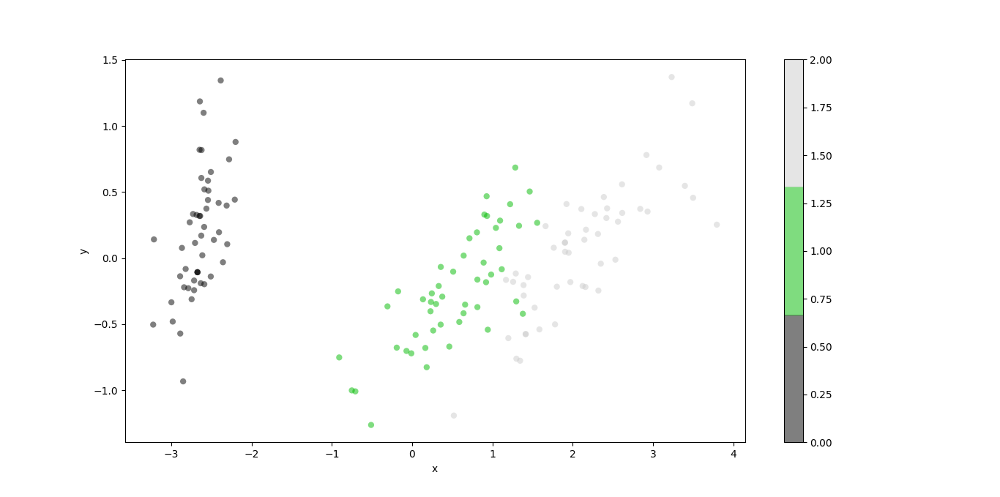
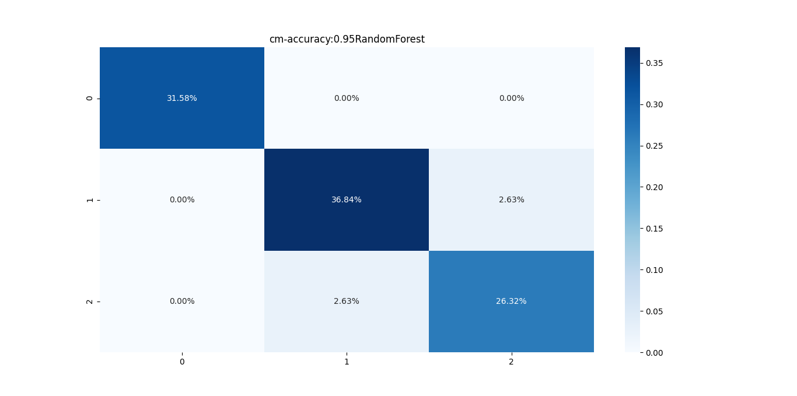
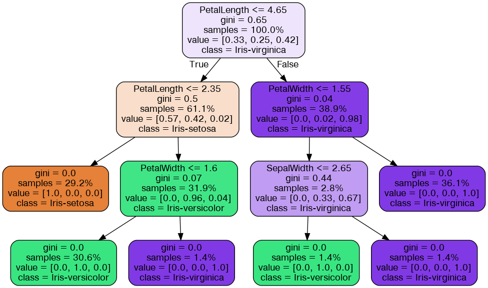
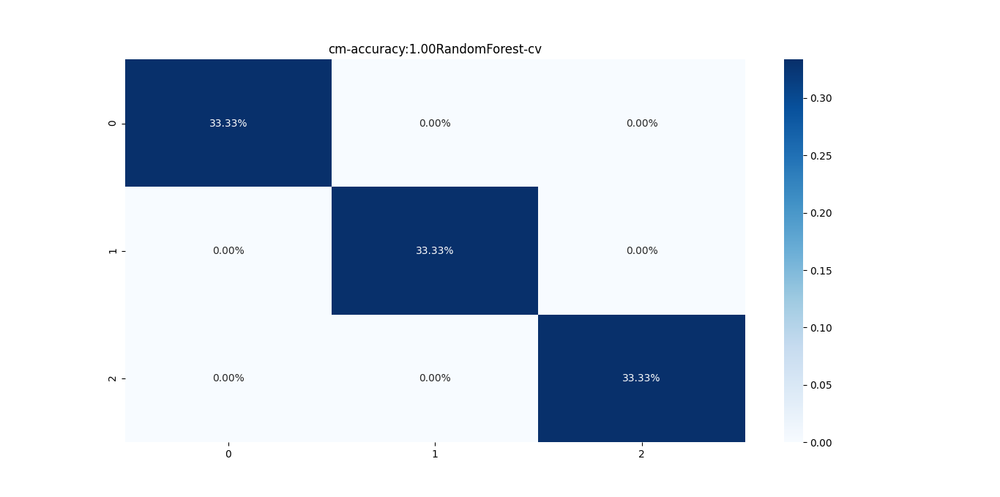
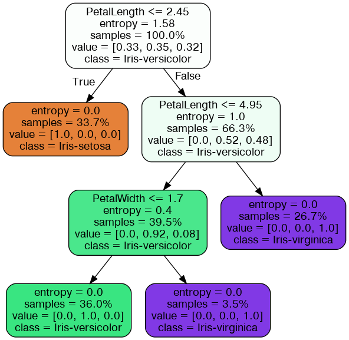

# Directory Structure
```text
.
├── api_test.py
├── app.py
├── data
│   └── iris_data.csv
├── docker-compose.yml
├── Dockerfile
├── figures
│   ├── Figure_cm-accuracy:0.95RandomForest.png
│   ├── Figure_cm-accuracy:1.00RandomForest-cv.png
│   ├── Figure_digits.png
│   ├── RandomForest-graph-cv.png
│   └── RandomForest-graph.png
├── graph
│   ├── RandomForest-graph-cv.dot
│   └── RandomForest-graph.dot
├── README.md
├── requirements.txt
├── run.py
├── utils
│   ├── data.py
│   ├── __init__.py
│   ├── model.py
│   └── plot.py
└── weights
    ├── RandomForest6l7xm.pkl
    ├── RandomForest-cv-1fssa.pkl
    ├── RandomForest-cv-4esbo.pkl
    └── RandomForest-cv-g9di4.pkl

5 directories, 23 files
```

# Command Line Interface
```text
usage: run.py [-h] [--load LOAD] [--cv CV]

optional arguments:
  -h, --help   show this help message and exit
  --load LOAD  True: Load trained model False: Train model default: True
  --cv CV      Run 10-Fold Cross Validation
```

# Data
```text
Features: sepalLength, sepalWidth, petalLength, petalWidth
```
```text
Labels: Iris-setosa, Iris-versicolor, Iris-virginica
```

# Plot the Iris Train & Test data with 2D PCA


# Install Graphviz to Visualize DecisionTree
```shell
sudo apt install graphviz
```

# RandomForest Parameters

```text
n_estimators: 1000 
```

```text
max_features: sqrt
```

# Additional CLI parameters
```text
gs: yes,no
```
```text
load: yes,no
```

# Train the RandomForest model

## Experiment 1 - Run Train-Test-Split

### Parameters

```text
n_estimators: 1000 
```

```text
max_features: sqrt
```


### CLI

```shell
 python run.py --load no --cv no
```

### Confusion Matrix



### Accuracy Score: 0.95

### Visualize the trained AdaBoost


## Experiment 2 - Run 10 Fold Cross Validation

### Parameters
```text
n_estimators: 100
```
```text
max_features: sqrt
```
```text
criterion: entropy
```

### CLI

```shell
python run.py --load no --cv yes
```

### Confusion Matrix


### Accuracy Score: 1.00

### Visualize the trained DecisionTree



## Prediction for
```text
sepalLength: 5.4
```
```text
sepalWidth: 3.7
```
```text
petalLength: 1.5
```
```text
petalWidth: 0.2
```
##  Class: Iris-setosa

# Load the trained model

```shell
python run.py --load yes 
```


# Docker for the model

## Build the Docker image

You can build docker image by following:

```shell
docker-compose build
```

## Run Docker container

You can launch a container from the Docker image by following:

```shell
docker-compose up
```

